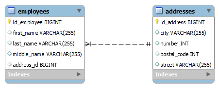

# Spring JPA OneToOne

Proyecto con implementación de la relacion One To One para dos tablas ("Empleados" y "Direcciones").

## Descripción

Para la realización de esta relación se debe usar la anotación @OneToOne propia de Spring JPA.

## Inicio

### Dependencias

* Spring v2.5.6, Spring JPA, MySQL driver, Java 8 (puede ser cualquier versión).
* Cualquier Sistema Operativo

### Instalación

* Clonar el repositorio
```
git clone https://github.com/Capdoo/spring-jpa-onetoone.git

```

* Crear la Base de Datos usando MySQL
```
CREATE DATABASE trabajadores CHARACTER SET utf8 COLLATE utf8_general_ci;

```


### Editar las propiedades

* Es necesario modificar el archivo application.properties
* Se debe indicar el nombre de usuario y contraseña de la Base de Datos

```
spring.datasource.url=jdbc:mysql://localhost:3306/onetotone
spring.datasource.username=[username]
spring.datasource.password=[password]
spring.datasource.driver-class-name=com.mysql.cj.jdbc.Driver

```

## Anotaciones

* One To One Annotation (@OneToOne)
Identificamos el modelo origen y usamos la notación
```
@OneToOne(cascade = CascadeType.ALL)
@JoinColumn(name = "direccion_id", referencedColumnName = "id_direccion", foreignKey = @ForeignKey(name = "USUARIO_FK_DIRECCION"))
private DireccionModel direccion;
```
* Mapped By Parameter (mappedBy)
  Identificamos el modelo destino y usamos el parametro indicando el campo en el modelo origen
```
@OneToOne(cascade =  CascadeType.ALL,mappedBy = "direccion")
private EmpleadoModel empleado;
```

## Relación


## Authors

Contribuidores y enlaces

. [@Capdoo](https://github.com/Capdoo)


## License

This project is licensed under the [NAME HERE] License - see the LICENSE.md file for details

## Acknowledgments

El fundamento de Spring JPA.
* [awesome-readme](https://www.baeldung.com/jpa-one-to-one)
